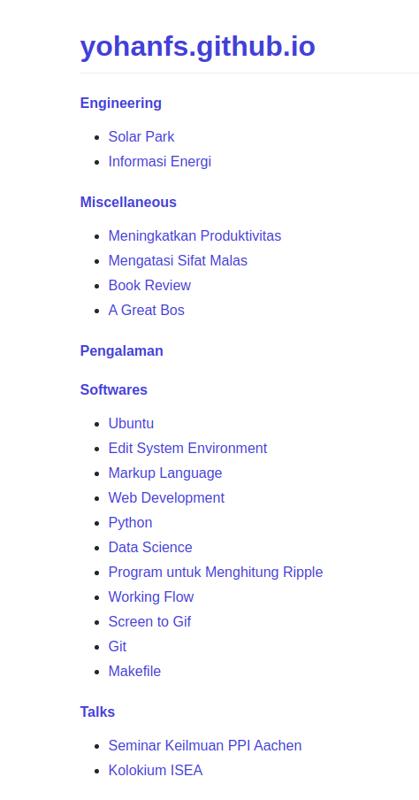
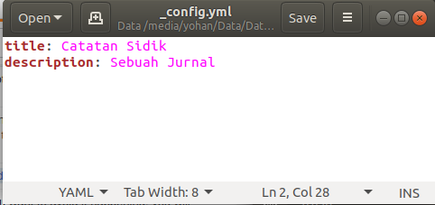
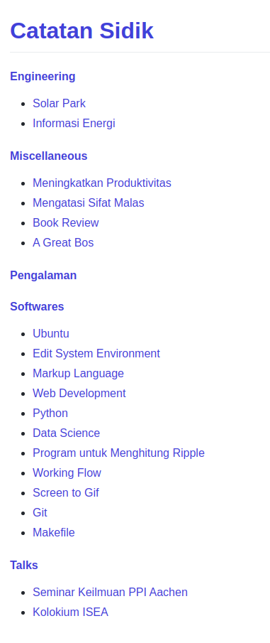
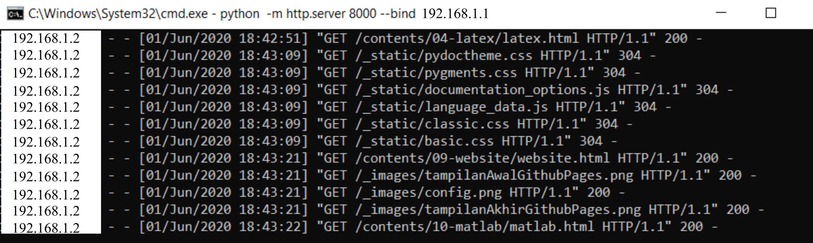

Website
=======================================================================================

.. contents:: Daftar Isi

Sumber Belajar Website
---------------------------------------------------------------------------------------

Referensi untuk belajar membuat website:

**Tutorial**

-  `Firefox - Web Development`_ - *recommended for beginner*
-  `W3School`_
-  `Web Programming UNPAS`_
-  `Tizag`_

**Static Web Generator**

-  `Github Page`_
-  `Jekyll`_
-  `Hugo`_
-  `Pelican`_

**Front-End Frameworks**

-  `Bootstrap`_
-  `Jquery`_
-  `Materialize`_

**Flask**

-  `Contoh website menggunakan Flask (Didesain oleh Yohan)`_
-  `How to build a web application using Flask and deploy it to the
   cloud`_
-  `Web programming with Python and JavaScript`_
-  `Build a simple, static, markdown-powered blog with flask`_
-  `Static websites with frozen flask`_
-  `Adding css styling to your website`_

**Website Menggunakan Pandoc**

-  `Building a Website using Pandoc, Markdown, and Static HTML`_
-  `Turn your book into a website and an ePub using Pandoc`_
-  `Convert any folder into a website using Pandoc and a Makefile`_
-  `Make: the ultimate static site generator`_
-  `Maintaining an academic website, part 1: Editing the site`_
-  `Makefiles: Part 2 — Makefiles Can Make Webpages?`_

**Templating Language**

-  `Liquid`_ + Jekyll (Ruby)
-  `Jinja`_ + Flask (Python)

.. _Firefox - Web Development: https://developer.mozilla.org/en-US/docs/Learn
.. _W3School: https://www.w3schools.com/
.. _Web Programming UNPAS: https://www.youtube.com/watch?v=NNW7Tg8CgAQ&t=549s
.. _Tizag: http://www.tizag.com/
.. _Github Page: https://nicolas-van.github.io/easy-markdown-to-github-pages/
.. _Jekyll: https://jekyllrb.com/
.. _Hugo: https://gohugo.io/
.. _Pelican: https://blog.getpelican.com/
.. _Bootstrap: https://getbootstrap.com/
.. _Jquery: https://jquery.com/download/
.. _Materialize: https://materializecss.com/
.. _Contoh website menggunakan Flask (Didesain oleh Yohan): https://fsidik.github.io/
.. _How to build a web application using Flask and deploy it to the cloud: https://www.freecodecamp.org/news/how-to-build-a-web-application-using-flask-and-deploy-it-to-the-cloud-3551c985e492/
.. _Web programming with Python and JavaScript: https://www.youtube.com/watch?v=j5wysXqaIV8&list=PLhQjrBD2T382hIW-IsOVuXP1uMzEvmcE5&index=4
.. _Build a simple, static, markdown-powered blog with flask: https://www.jamesharding.ca/posts/simple-static-markdown-blog-in-flask/
.. _Static websites with frozen flask: http://john-b-yang.github.io/flask-website/
.. _Adding css styling to your website: https://pythonhow.com/add-css-to-flask-website/
.. _Building a Website using Pandoc, Markdown, and Static HTML: http://wstyler.ucsd.edu/posts/pandoc_website.html
.. _Turn your book into a website and an ePub using Pandoc: https://opensource.com/article/18/10/book-to-website-epub-using-pandoc
.. _Convert any folder into a website using Pandoc and a Makefile: https://computableverse.com/blog/create-website-using-pandoc-make-file
.. _`Make: the ultimate static site generator`: https://themattchan.com/blog/2017-02-28-make-site-generator.html
.. _`Maintaining an academic website, part 1: Editing the site`: https://brianbuccola.com/maintaining-an-academic-website-part-1-editing-the-site/
.. _`Makefiles: Part 2 — Makefiles Can Make Webpages?`: https://www.norwegiancreations.com/2018/07/makefiles-part-2-makefiles-can-make-webpages/
.. _Liquid: https://shopify.github.io/liquid/
.. _Jinja: https://jinja.palletsprojects.com/en/2.10.x/

Jekyll
---------------------------------------------------------------------------------------

Install Jekyll
***************************************************************************************

Langkah-langkah untuk menginstall Jekyll:

- Download dan Install `Ruby+Devkit <https://rubyinstaller.org/downloads/>`_.
- Run **ridk install** kemudian tekan tombol *Finish*. Selanjutnya akan muncul menu yang berisi 3 pilihan. Pilih saja pilihan no 1 dan kemudian tekan *Enter*.
- Buka *command prompt windows*:
     * Install Jekyll dengan *command* berikut: **gem install jekyll bundler**.
     * Cek apakah jekyll sudah terinstall di komputer anda dengan *command* berikut: **jekyll -v**.

**Referensi**

- `Jekyll on Windows <https://jekyllrb.com/docs/installation/windows/>`_

Github Pages
---------------------------------------------------------------------------------------

Mengubah Judul Web di Github Pages
***************************************************************************************

Kumpulan *Markdown Files* dapat disajikan menjadi sebuah website di Github. Index filenya bernama README.md. Dengan menggunakan file tersebut, secara otomatis akan dibuatkan halaman index yang mengarah ke README.md. Namun, judul website-nya secara otomatis diambil dari nama *github repository* website tersebut. Contohnya adalah sebagai berikut:

Judul *default* tersebut dapat diubah dengan cara menyertakan file _config.yml pada repository website tersebut. Contoh file _config.yml adalah sebagai berikut:

Setelah file tersebut disertakan dan file tersebut telah dipush ke repository website maka hasilnya adalah sebagai berikut:

**Referensi**

- `Change the site title gh pages <https://talk.jekyllrb.com/t/how-to-change-the-site-title-gh-pages/1119/4>`_

Local Server
---------------------------------------------------------------------------------------

Saya memiliki sebuah folder yang berisi file html yang digenerate oleh Sphinx. Di komputer lokal, website tersebut dapat diakses dengan membuka index.html. Permasalahannya adalah bagaimanakah caranya agar website lokal tersebut dapat diakses oleh perangkat lain (komputer atau smartphone) dalam jaringan internet yang sama. Solusinya adalah dengan menyajikan file html tersebut dengan web server. Python memiliki web server sederhana yang bernama `HTTP Servers`_.

Misalnya, website lokal berada di komputer dengan IP Address: 192.168.1.1, maka web server dapat dijalankan di folder yang berisi html (untuk Sphinx: build/html) dengan cara mengetikkan perintah berikut di terminal:

::

        python -m http.server 8000 --bind 192.168.1.1

Selanjutnya, website tersebut dapat diakses di perangkat lain dengan menggunakan alamat di bawah ini:

::

        https://192.168.1.1:8000

Bila sebuah perangkat mengakses website ini, maka web server yang dijalankan di terminal akan memberikan informasi pengaksesannya, misalnya:

.. _HTTP Servers: https://docs.python.org/3/library/http.server.html

Konversi rST ke HTML
---------------------------------------------------------------------------------------

Contoh file rst:

::

        ============================
        Contoh Web
        ============================

        :Author: Yohan Sidik

        .. contents:: Daftar Isi

        contoh1
        ---------------------------

        Ini adalah contoh 1

        contoh2
        ---------------------------

        Ini adalah contoh 2

Python script untuk compile:

::

        import os

        os.system('cmd /k rst2html --stylesheet=docutils_basic.css thinkNotes.rst ThinkNotes.html')

