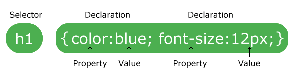
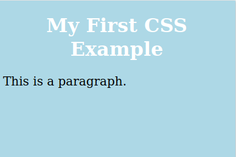
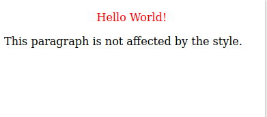
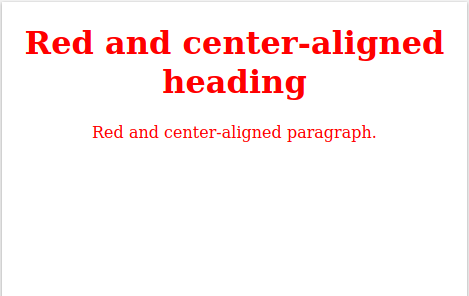

Cascading Style Sheets
=================================================================================

.. contents:: **Daftar Isi**

Referensi
---------------------------------------------------------------------------------

- `w3schools.com`_
- `Learn to style HTML using CSS`_

Mengapa Menggunakan CSS?
---------------------------------------------------------------------------------

CSS digunakan untuk mendefinisikan style dari web pages, termasuk design,
dan layout untuk perangkat dan ukuran layar yang berbeda. 

Cara Insert CSS
---------------------------------------------------------------------------------

External CSS
*********************************************************************************

**contoh.html**

::

	<!DOCTYPE html>
	<html>
	<head>
	<link rel="stylesheet" href="mystyle.css">
	</head>
	<body>

	<h1>This is a heading</h1>
	
This is a paragraph.

	</body>
	</html> 

**mystyle.css**

::

	body {
	  background-color: lightblue;
	}

	h1 {
	  color: navy;
	  margin-left: 20px;
	}

Internal CSS
*********************************************************************************

::

	<!DOCTYPE html>
	<html>
	<head>
	
	</head>
	<body>

	<h1>This is a heading</h1>
	
This is a paragraph.

	</body>
	</html> 

Inline CSS
*********************************************************************************

::

	<!DOCTYPE html>
	<html>
	<body>

	<h1 style="color:blue;text-align:center;">This is a heading</h1>
	
This is a paragraph.

	</body>
	</html>

 
CSS Syntax
---------------------------------------------------------------------------------

CSS Element Selector
---------------------------------------------------------------------------------

::

	<!DOCTYPE html>
	<html>
	<head>
	
	</head>
	<body>

	<h1>My First CSS Example</h1>
	
This is a paragraph.

	</body>
	</html>

CSS ID Selector
---------------------------------------------------------------------------------

::

	<!DOCTYPE html>
	<html>
	<head>
	
	</head>
	<body>

	
Hello World!

	
This paragraph is not affected by the style.

	</body>
	</html>

CSS Class Selector
---------------------------------------------------------------------------------

::

	<!DOCTYPE html>
	<html>
	<head>
	
	</head>
	<body>

	<h1 class="center">Red and center-aligned heading</h1>
	
Red and center-aligned paragraph.
 

	</body>
	</html>

.. Referensi

.. _`w3schools.com`: https://www.w3schools.com/css/default.asp
.. _`Learn to style HTML using CSS`: https://developer.mozilla.org/en-US/docs/Learn/CSS

